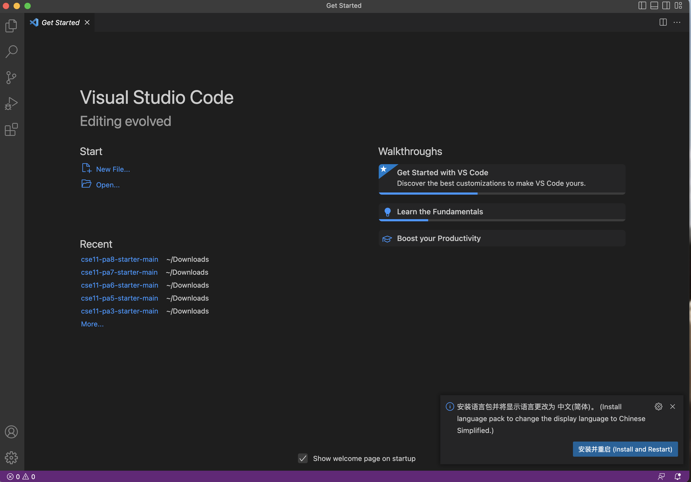

Part 1 - Visual Studio Code    
We need to to download and install the Visual Studio Code on our own computer by the instructions , the Visual Studio Code website is: https://code.visualstudio.com/. 
It has versions for all major operating systems, for example, macOS(for Macs) and Windows(for PCs).      
After we stalled it, we should be able to open a window that looks like the screenshot(it may have different colors, or a different
menu bar, depending on our system and settings):          
.    
