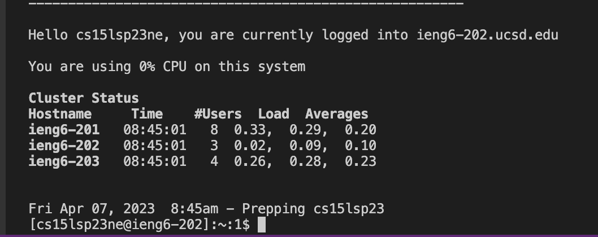
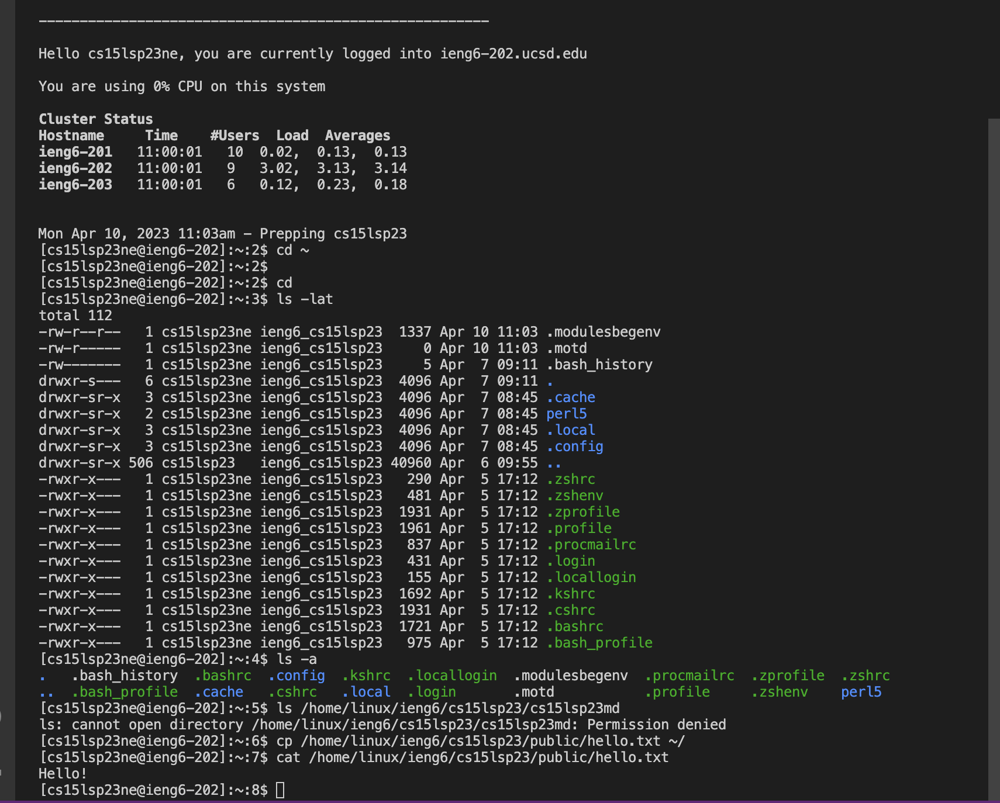

Part 1 - Set Up Visual Studio Code    
We need to to download and install the Visual Studio Code on our own computer by the instructions , the Visual Studio Code website is [code.visualstudio](https://code.visualstudio.com). 
It has versions for both macOS(for Macs) and Windows(for PCs).      
After we stalled it, we should be able to open a window that looks like the screenshot below(it may have different colors, language, or menu bars, which depends on our system and settings):          
              

                  
Part 2 - Connecting Our Accounts            
For people who use macOS, in order to use ssh open the terminal in the Visual Studio Code, click Terminal and then New Terminal, after that, we can type the command in the terminal, which is:  
ssh cs15lsp23ne@ieng6.ucsd.edu (Notes: The letters "ne" in the command line stands for my account, you should write the exactly same letters as in your own account). Then the terminal will show a message like this: " The authenticity of host 'ieng6.ucsd.edu (128.54.70.227)' can't be established.
RSA key fingerprint is SHA256:ksruYwhnYH+sySHnHAtLUHngrPEyZTDl/1x99wUQcec. Are you sure you want to continue connecting (yes/no/[fingerprint])? ". I cannot give you the sreenshot of mine since I already finish these steps. So type "yes" in the terminal and hit enter.                       
After you type "yes", the terminal will let you type in the password for your account. You will not see the password while you are typing because it is a security method to protect our account. Here is the screenshot after we type our password(excpet the account show in the first line should be your account number and the logged in time will be different):             
           

               
Part 3 - Trying Some Commands            
You can type these commands in your terminal:         
cd ~       
cd        
ls -lat        
ls -a        
ls /home/linux/ieng6/cs15lsp23/cs15lsp23abc      (Notes: "abc" should be one of your group members' username)               
cp /home/linux/ieng6/cs15lsp23/public/hello.txt ~/               
cat /home/linux/ieng6/cs15lsp23/public/hello.txt                

When you type the first command "cd~", the terminal will show an empty line; if you type the second and third commands ,termianl will show nothing, don't worry, it is normal, just keep entering the commands. Here is the sreenshot of my terminal after I run those command line above: 
                   
Notes: Yours may have some differences compare to mine screenshot due to the various of version of Macs and differnt username you entered.                  
If you finish all three parts above, you can log out the remote server by typing "exit" in your terminal and hit enter, or use Ctrl-D.       
